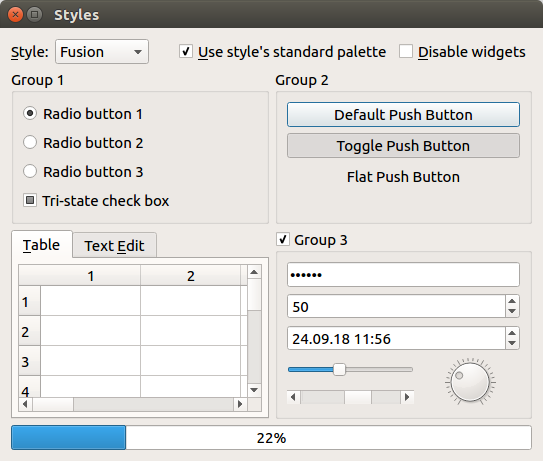

# PyQt Widgets

A *widget* is a GUI element: A button, a text field, ... The sample application in this directory shows the most common PyQt widgets:

If you know HTML: Widgets are a little like HTML elements. They can be nested, and have a different appearance and behavior depending on their type. (Eg. a link `<a>` looks and behaves differently from an image ``.)

Some of the widgets you can see in this screenshot are:

 * [QLabel](https://doc.qt.io/qt-5/qlabel.html)
 * [QComboBox](https://doc.qt.io/qt-5/qcombobox.html)
 * [QCheckBox](https://doc.qt.io/qt-5/qcheckbox.html)
 * [QRadioButton](https://doc.qt.io/qt-5/qradiobutton.html)
 * [QPushButton](https://doc.qt.io/qt-5/qpushbutton.html)
 * [QTableWidget](https://doc.qt.io/qt-5/qtablewidget.html)
 * [QLineEdit](https://doc.qt.io/qt-5/qlineedit.html)
 * [QSlider](https://doc.qt.io/qt-5/qslider.html)
 * [QProgressBar](https://doc.qt.io/qt-5/qprogressbar.html)

The source code for this application is in [`main.py`](main.py). For instructions how to run it, please see [here](https://github.com/1mh/pyqt-examples#running-the-examples). Don't worry if you don't yet fully understand the source code. The main purpose of this example is to give you a feel for what a widget is, and which ones are available. The next examples give you a more gradual route to more advanced PyQt topics.
