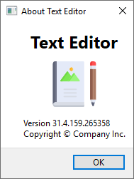

# PyQt5 exe

Once you have a PyQt5 application, you want to compile your Python source code into a standalone executable. Furthermore, you normally want to create an installer so your users can easily set up your app.

This example uses [fbs](https://build-system.fman.io) to create a standalone executable and an installer for the text editor in [example 07](../07%20Qt%20Text%20Editor).

 

You can find a modified version of the ["old" main.py](../07%20Qt%20Text%20Editor/main.py) in [`src/main/python/main.py`](src/main/python/main.py). It only has a few extra lines:

We import fbs's `ApplicationContext`:

    from fbs_runtime.application_context.PyQt5 import ApplicationContext

Further down, we instantiate it:

    appctxt = ApplicationContext()

We no longer need to create a `QApplication`. This is done automatically by fbs.

The editor's _About_ dialog shows an icon:

This is done in the original code as follows:

    text = "......"

The new code however needs to be more flexible with regard to the icon's path. When running from source, the icon lies in [`src/main/resources/base/icon.svg`](src/main/resources/base/icon.svg). When running on the user's system however, it lies in the installation directory.

To handle this, the new code uses fbs's [`ApplicationContext.get_resource(...)`](https://build-system.fman.io/manual/#get_resource) method:

    text = "......" % appctxt.get_resource("icon.svg")

This automatically handles the different possible locations of the image.

Because we didn't create the `QApplication` ourselves, we finally use the following call instead of only `app.exec_()`:

    appctxt.app.exec_()

To run this example yourself, you need fbs installed as per the instructions [here](https://github.com/pyqt/examples#running-the-examples). Then, you can do use the following command to run the text editor:

    fbs run

The following command then compiles the Python source code into a standalone executable in your `target/` directory:

    fbs freeze

Finally, the following creates an installer that you can distribute to other people:

    fbs installer

Please note that this last command requires that you have [NSIS](https://nsis.sourceforge.io/Main_Page) installed and on your `PATH` on Windows, or [`fpm`](https://github.com/jordansissel/fpm) on Linux.
